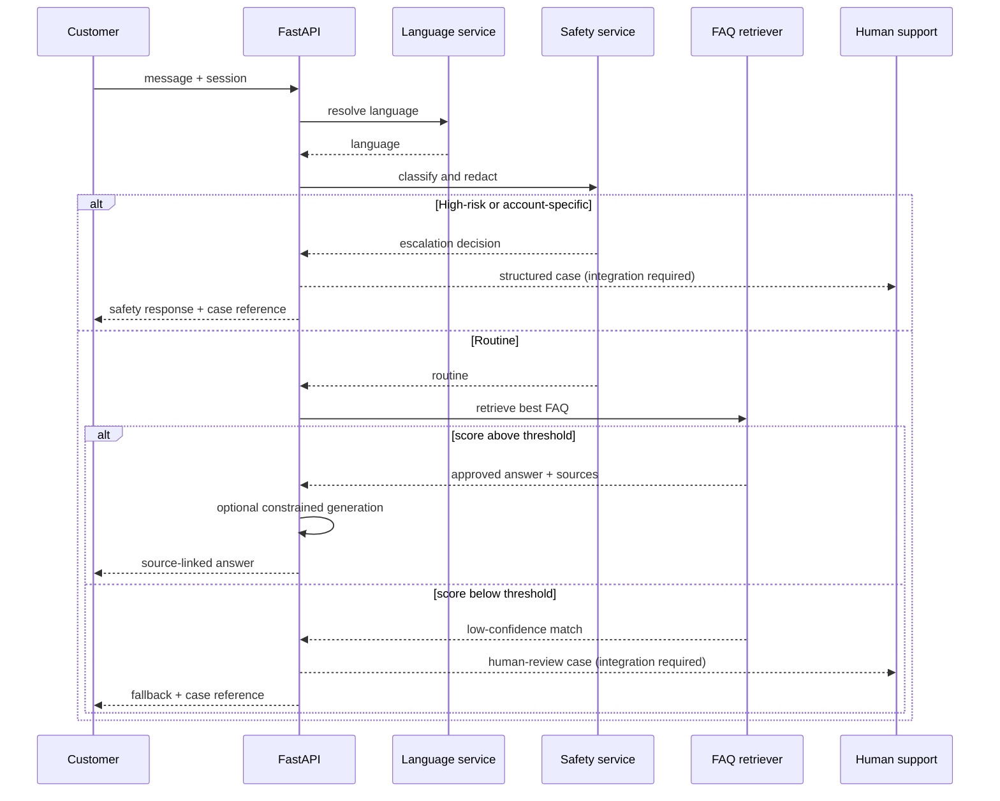

# Architecture

## Design goals

1. Answer a small, approved FAQ domain consistently.
2. Support English, Hausa, Igbo, Nigerian Pidgin and Yoruba without relying on free-form generation.
3. Preserve a user's language choice across requests.
4. Route high-risk fintech conversations to a human.
5. Keep transport adapters separate from business logic.
6. Retain public source links for auditability.

## Components

### API layer

`src/taja_bot/api.py` exposes the browser demo, health endpoint, FAQ endpoint, chat endpoint and Gupshup webhook. The API contains no retrieval or language-selection logic; it delegates to services.

### Chat orchestration

`ChatService` coordinates language selection, menu commands, safety classification, retrieval and response construction. It also creates non-sequential case references with an HMAC-based digest.

### Language service

The language service supports explicit API language codes, menu numbers, language names and conservative lexical detection. Session state takes priority after a user has selected a language.

### FAQ retrieval

Each FAQ contains multiple question forms and keywords in every language. At startup, the service builds a character n-gram TF-IDF matrix. At request time it combines:

- cosine similarity against the TF-IDF matrix;
- RapidFuzz weighted string similarity;
- keyword-hit bonuses;
- exact menu-number selection.

Character n-grams provide tolerance for spelling variation and code-switching without sending customer text to a third-party model.

### Optional RAG generator

When `ANSWER_MODE=openai`, the retrieved FAQ answer is supplied to the OpenAI Responses API as the only factual context. The generator may rephrase it in the selected language but may not add facts. Provider failures return the stored answer. Deterministic mode remains the default.

### Safety classifier

The safety layer runs before FAQ retrieval. It identifies likely fraud/security reports, formal complaints, account-access/KYC issues, restricted financial advice and messages containing common secrets. Secrets are redacted before they can appear in application logs or diagnostic fields.

### Session store

The default in-memory store is suitable for local development and a single process. Redis is required when language state must be shared across multiple workers or instances.

### Transport adapters

The Gupshup adapter parses the legacy-style event envelope and optionally sends the bot's answer. Other providers should be added as adapters rather than embedded in `ChatService`.

## Request path

## Production extensions

- Persist case records in an approved database.
- Create tickets in Taja's authorised support platform.
- Add signed webhook verification for the chosen provider.
- Add request rate limiting and a web application firewall.
- Run translation review with fluent speakers and company compliance staff.
- Add source synchronisation with change approval rather than silently scraping live pages.
